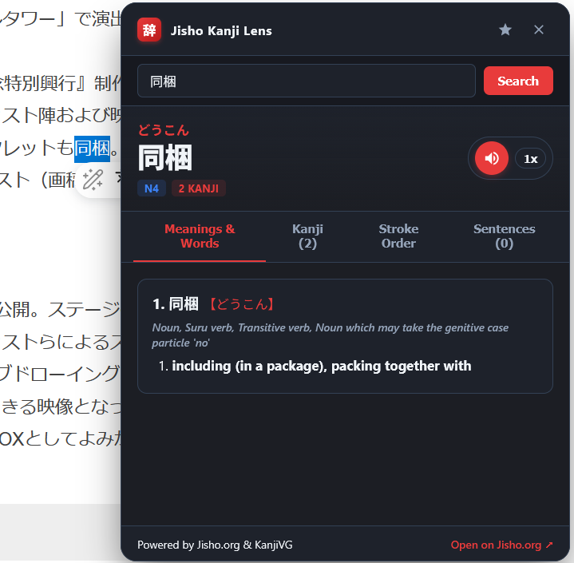
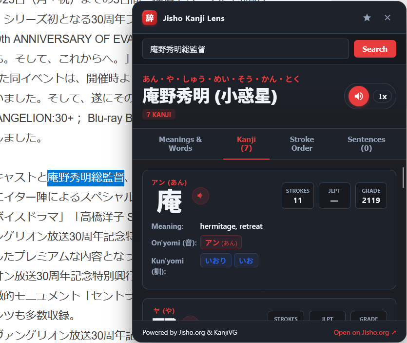
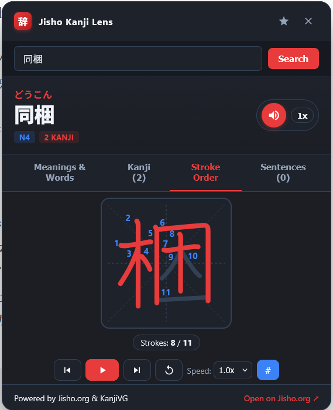

# Jisho Kanji Lens for Firefox

Jisho Kanji Lens is a Mozilla Firefox extension that enables instant lookups of Japanese Kanji, vocabulary, and phrases directly from any webpage using data from Jisho.org.

---

## Disclaimer

This extension is an independent open-source project and is not affiliated, associated, authorized, endorsed by, or in any way officially connected with [Jisho.org](https://jisho.org) or any of its subsidiaries or affiliates. All dictionary and linguistic data referenced by this tool are the property of their respective owners and projects (including EDICT/JMdict, KANJIDIC, and KanjiVG).

---

## Key Features

- **Contextual In-Page Lookup**: Highlight any Japanese word or Kanji, right-click, and select **"Search Jisho"** to view definitions in a floating window.
- **Kanji Breakdown and Reading Badges**: View character-by-character breakdowns with ruby Furigana, stroke counts, JLPT levels, and color-coded On'yomi and Kun'yomi readings.
- **Animated Stroke Order**: Interactive stroke-by-stroke diagrams for Kanji characters with playback and speed controls.
- **Pronunciation Audio**: Native audio pronunciation with real-time speed adjustments (0.5x to 1.5x).
- **Wordbook and Anki Export**: Save words to your personal list and export them to Anki TSV format.
- **Toolbar Search**: Quick dictionary search accessible directly from the browser toolbar.

---

## Preview

  
  &nbsp;
  
  &nbsp;
  

---

## Installation Guide

### Option 1: Load as a Temporary Add-on (Recommended for Testing)

1. Open Firefox and navigate to `about:debugging#/runtime/this-firefox`.
2. Click the **Load Temporary Add-on...** button.
3. Browse to the extension directory and select `manifest.json`.
4. The extension is now active in your browser.

### Option 2: Install from Release Package

1. Download the latest `.xpi` or `.zip` file from the [Releases](https://github.com/afaroee/jisho-extension-firefox/releases) page.
2. In Firefox, open `about:addons` and drag the downloaded file into the browser window to install.

---

## How to Use

### 1. In-Page Lookup & Vocabulary
1. Highlight any Japanese text or Kanji on any webpage.
2. Right-click and select **"Search Jisho for '...'"**, or press **Alt + J**.
3. A floating card appears displaying readings, definitions, JLPT badges, and audio pronunciation.
4. Click the speaker button to hear pronunciation with adjustable playback speed, or the star button to save the word to your wordbook.

  

### 2. Kanji Breakdown & Reading Badges
1. For multi-Kanji terms, switch to the **Kanji** tab to inspect each individual character.
2. Review Furigana ruby annotations above the compound word, stroke counts, and JLPT/grade ranks.
3. Consult distinct, color-coded badges for On'yomi (Katakana/Hiragana) and Kun'yomi readings.
4. Click the individual speaker icon next to any Kanji to hear its specific pronunciation.

  

### 3. Animated Stroke Order
1. Switch to the **Stroke Order** tab to inspect the interactive KanjiVG stroke diagram.
2. Use the play/pause button to watch the stroke animation, or step forward and backward stroke by stroke.
3. Adjust playback speed (0.5x, 1x, 2x) or toggle stroke number guides as needed.

  

### 4. Toolbar Quick Search
1. Click the extension icon in the Firefox toolbar (or press **Alt + Shift + J**).
2. Type any English word, Romaji, Hiragana, or Kanji in the search field.
3. View dictionary entries, animated strokes, and your search history.

### 5. Exporting to Anki
1. Open the toolbar popup and navigate to the **Wordbook** tab.
2. Click **Export Anki** to download a formatted `.tsv` file.
3. In Anki, select **File > Import** and choose the downloaded file.

---

## Keyboard Shortcuts

| Shortcut | Action |
| :--- | :--- |
| **Alt + J** | Look up selected text on the active page |
| **Alt + Shift + J** | Open toolbar search popup |
| **Esc** | Close active floating lookup card |

---

## License

This project is licensed under the MIT License.
